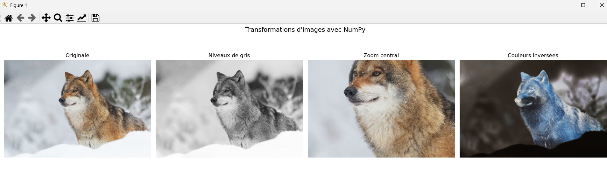

# transformations-images-numpy
Transformations d'images avec NumPy et Matplotlib - Python
# Transformations d'images avec NumPy

Projet personnel de traitement d'images en Python,
réalisé en parallèle de ma formation Développeur IA.

## Technologies utilisées
- Python
- NumPy
- Matplotlib

## Transformations réalisées
- Conversion en niveaux de gris
- Zoom sur la zone centrale (slicing NumPy)
- Inversion des couleurs

## Aperçu

## Lancer le projet
1. Cloner le repository
2. Placer une image JPG dans le dossier
3. Remplacer 'ta_photo.jpg' par le nom de votre image
4. Lancer le script
